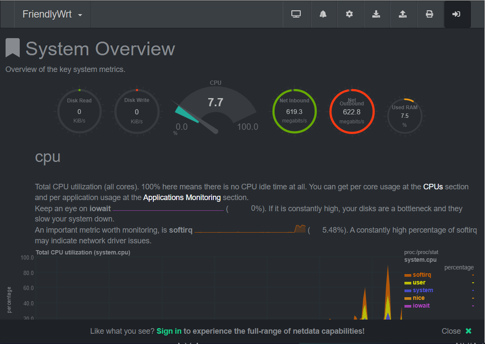

# 使用 Github Actions 在线编译 NanoPi-R2s 固件

## 温情提醒

WAN 和 LAN 默认是**互换**的，请注意网线接法。

刷机请**不要**保留配置，任何因保留配置导致的问题不给予解决！

## 相关链接

预编译的版本：

https://github.com/fanck0605/nanopi_r2s/releases

本项目采用的源码：

https://github.com/fanck0605/friendlywrt

https://github.com/fanck0605/friendlywrt-kernel

## 说明

* ipv4: 192.168.2.1
* username: root
* password: password

## 特色

* 完美的 Flow Offload 支持，不与 PPPoE 冲突，降低 CPU 负载
* 开启了 [FullCone NAT](https://github.com/Chion82/netfilter-full-cone-nat)，对游戏用户支持更佳
* 支持 IPv6，可以访问最新 IPv6 规范的互联网。
    - 需要关闭 *网络* -> *DHCP/DNS* -> *高级设置* -> *禁止解析 IPv6 DNS 记录*
* WAN 和 LAN 互换，LAN 口是原生千兆网卡，更加稳定

## 用法

1. Fork 到自己的账号下
2. 进入 Actions 界面，启用 Github Actions(**必须要先启用**)
3. 在 `config_rk3328` 文件中，自定义所需要的软件包
     - 比如需要 `luci-app-samba`， 那么只要在文件中添加一行 `CONFIG_PACKAGE_luci-app-samba=y`
     - 只需添加 `luci-app-samba` 即可，依赖会自动补全；请不要去自己添加任何多余组件，除非你知道自己在做什么。

## 性能测试

下图为 500Mbps 电信家宽（PPPoE）测速，实际占用和连接数有关。在 500Mbps 满速 BT 下载时，占用可以高达 40%。
所以 FlowOffload 还是有用的，毕竟如果测速都快占满 CPU 了，就没有剩余资源给其他网络操作了，实际使用肯定大打折扣的。

## 注意

代码已经趋于稳定，一般情况不会编译失败。如果我哪天闲的蛋疼更新了源码，导致编译失败时，还请麻烦过来查看 `.yml` 与 `config` 最新异动。

cifsd 与 samba 有冲突，只能二选一。(cifsd 暂时无法工作)
ps: 可能是永久

## 特别感谢

* [soffchen/NanoPi-R2S](https://github.com/soffchen/NanoPi-R2S)
* [klever1988/nanopi-openwrt](https://github.com/klever1988/nanopi-openwrt)
* [coolsnowwolf/lede](https://github.com/coolsnowwolf/lede)
* [Lienol/openwrt](https://github.com/Lienol/openwrt)
* [friendlyarm/friendlywrt](https://github.com/friendlyarm/friendlywrt)
